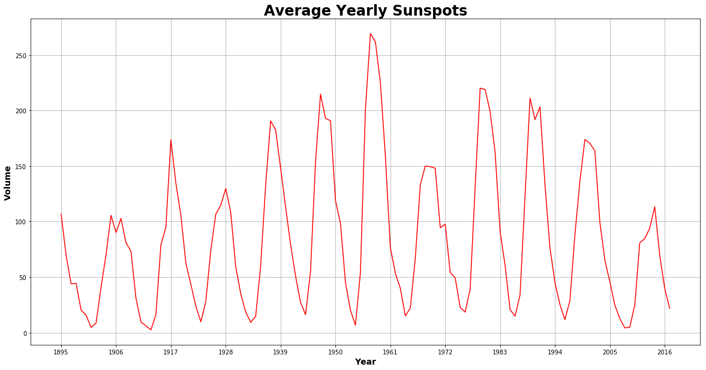
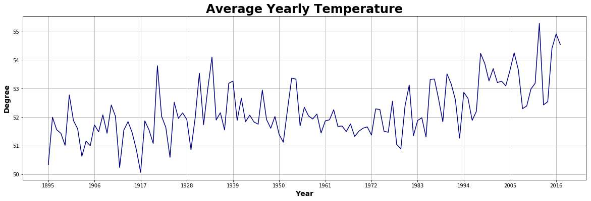
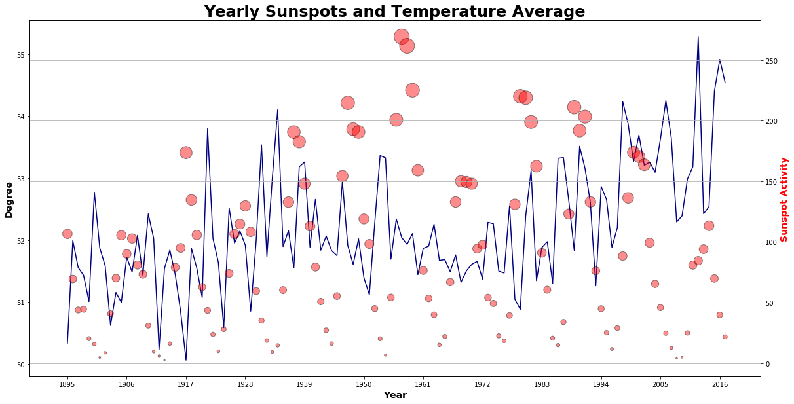
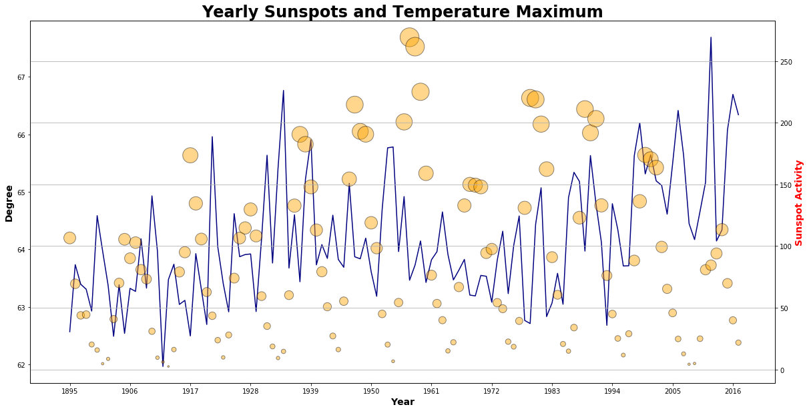
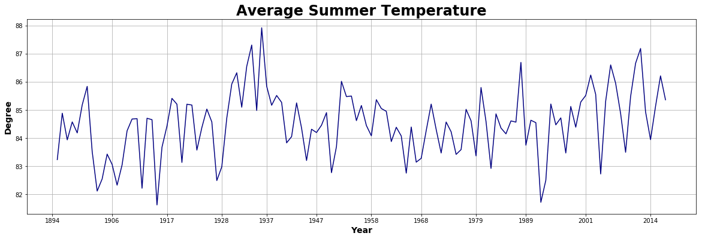
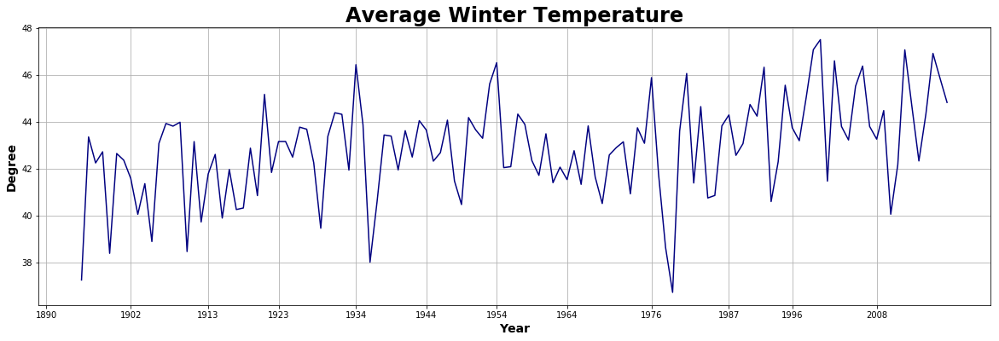

Solis Projectum => Data Analysis
--------------------------------

.. code:: ipython3

    from scipy import stats
    from scipy.stats import linregress
    import matplotlib.pyplot as plt
    import pandas as pd
    import numpy as np
    import solis

.. code:: ipython3

    # Data file locations
    clean_dir = "data/clean"
    plots_file_name = "plots/Solis-Projectum."

.. code:: ipython3

    solar_maximum_years = [1894, 1906, 1917, 1928, 1937, 1947, 1958, 1968, 1979, 1989, 2001, 2014]
    solar_minimum_years = [1890, 1902, 1913, 1923, 1934, 1944, 1954, 1964, 1976, 1987, 1996, 2008]

Load the Clean data
~~~~~~~~~~~~~~~~~~~

--------------

.. code:: ipython3

    #### Sunspots
    csv_file_sunspots = {"monthly":"sunspot_monthly.csv","yearly":"sunspot_yearly.csv"}
    
    sunspot_monthly = solis.load_csv(csv_file_sunspots["monthly"])
    sunspot_monthly = sunspot_monthly.set_index("Year")
    
    sunspot_yearly = solis.load_csv(csv_file_sunspots["yearly"])
    sunspot_yearly = sunspot_yearly.set_index("Year")

.. code:: ipython3

    #### Temperature
    csv_file_temp = {"avg":"temp_average.csv","max":"temp_maximum.csv","min":"temp_minimum.csv"}
    
    temp_average = solis.load_csv(csv_file_temp["avg"])
    temp_average = temp_average.set_index("Year")
    
    temp_maximum = solis.load_csv(csv_file_temp["max"])
    temp_maximum = temp_maximum.set_index("Year")
    
    temp_minimum = solis.load_csv(csv_file_temp["min"])
    temp_minimum = temp_minimum.set_index("Year")

.. code:: ipython3

    #### Cooling & Heating Days
    csv_file_heatcool = {"summer":"summer_cooling_days.csv","winter":"winter_heating_days.csv"}
    
    summer_cooling_days = solis.load_csv(csv_file_heatcool["summer"])
    winter_heating_days = solis.load_csv(csv_file_heatcool["winter"])

Plots
~~~~~

--------------

Space Weather
=============

.. code:: ipython3

    # Generate the Plot
    plt.figure(figsize = (20,10))
    plt.title("Average Yearly Sunspots",fontdict = {'fontsize': 24, 'fontweight': 'bold'})
    plt.ylabel("Volume", fontdict = {'fontsize': 14, 'fontweight': 'bold'})
    plt.xlabel("Year", fontdict = {'fontsize': 14, 'fontweight': 'bold'})
    plt.xticks(np.arange(1895,2020,step=11))
    plt.grid(True)
    
    x_axis = sunspot_yearly.index
    sunspot_yearly_mean_total = sunspot_yearly["Yearly Mean Total Sunspots"]
    
    plt.plot(x_axis, sunspot_yearly_mean_total, color='red')
    plt.savefig(plots_file_name+"Average.Yearly.Sunspots.png")
    plt.show()

Terra Firma Weather
===================

.. code:: ipython3

    # Generate the Plot
    plt.figure(figsize = (20,6))
    plt.title("Average Yearly Temperature",fontdict = {'fontsize': 24, 'fontweight': 'bold'})
    plt.ylabel("Degree", fontdict = {'fontsize': 14, 'fontweight': 'bold'})
    plt.xlabel("Year", fontdict = {'fontsize': 14, 'fontweight': 'bold'})
    plt.xticks(np.arange(1895,2020,step=11))
    plt.grid(True)
    
    x_axis = temp_average.index
    
    plt.plot(x_axis, temp_average.mean(axis=1), color='navy')
    plt.savefig(plots_file_name+"Average.Yearly.Temperature.png")
    plt.show()

.. code:: ipython3

    # Generate the Plot
    fig = plt.figure(figsize = (20,10))
    ax1 = fig.add_subplot(1, 1, 1)
    ax2 = ax1.twinx()
    
    ax1.set_title("Yearly Sunspots and Temperature Average",fontdict = {'fontsize': 24, 'fontweight': 'bold'})
    ax1.set_xlabel("Year", fontdict = {'fontsize': 14, 'fontweight': 'bold'})
    ax1.set_ylabel("Degree", fontdict = {'fontsize': 14, 'fontweight': 'bold'})
    ax2.set_ylabel("Sunspot Activity", fontdict = {'fontsize': 14, 'fontweight': 'bold'}, color = "red")
    
    x_axis = temp_average.index
    
    ax1.set_xticks(np.arange(1895,2020,step=11))
    ax1.plot(x_axis, temp_average.mean(axis=1), color='navy')
    ax2.scatter(x_axis, sunspot_yearly_mean_total, color='red', edgecolors='black', s=(sunspot_yearly_mean_total*2), alpha=.45)
    
    plt.grid(True)
    plt.savefig(plots_file_name+"Yearly.Sunspots_Temperature.Average.png")
    plt.show()

.. code:: ipython3

    # Generate the Plot
    fig = plt.figure(figsize = (20,10))
    ax1 = fig.add_subplot(1,1,1)
    ax2 = ax1.twinx()
    
    ax1.set_title("Yearly Sunspots and Temperature Maximum",fontdict = {'fontsize': 24, 'fontweight': 'bold'})
    ax1.set_xlabel("Year", fontdict = {'fontsize': 14, 'fontweight': 'bold'})
    ax1.set_ylabel("Degree", fontdict = {'fontsize': 14, 'fontweight': 'bold'})
    ax2.set_ylabel("Sunspot Activity", fontdict = {'fontsize': 14, 'fontweight': 'bold'}, color = "red")
    
    x_axis = temp_maximum.index
    
    ax1.set_xticks(np.arange(1895,2020,step=11))
    ax1.plot(x_axis, temp_maximum.mean(axis=1), color='navy')
    ax2.scatter(x_axis, sunspot_yearly_mean_total, color='orange', edgecolors='black', s=(sunspot_yearly_mean_total*3), alpha=.45)
    
    plt.grid(True)
    plt.savefig(plots_file_name+"Yearly.Sunspots_Temperature.Maximum.png")
    plt.show()

Summer and Winter
~~~~~~~~~~~~~~~~~

.. code:: ipython3

    temp_maximum = temp_maximum.reset_index()
    temp_maximum_summer = temp_maximum[["Year", "June", "July", "Aug"]]
    temp_maximum_summer = temp_maximum_summer.set_index("Year")

.. code:: ipython3

    temp_minimum = temp_maximum.reset_index()
    temp_minimum_winter = temp_minimum[["Year", "Jan", "Feb", "Dec"]]
    temp_minimum_winter = temp_minimum_winter.set_index("Year")

.. code:: ipython3

    temp_min_winter = pd.DataFrame(temp_minimum_winter.stack(level=0))
    temp_min_winter = temp_min_winter.reset_index()
    temp_min_winter.rename(index=str, columns={'level_1': 'Month',0:'Temp'}, inplace=True)

.. code:: ipython3

    # winter carries over into next calendar year; adjusted dataset for "Winter Year"
    winter_year = []
    for index, row in temp_min_winter.iterrows():
        if row["Month"] == "Dec":
            winter_year.append(row["Year"]+1)
        else:
            winter_year.append(row["Year"])
    
    temp_min_winter["Winter Year"] = winter_year

.. code:: ipython3

    # Generate the Plot (summer)
    plt.figure(figsize = (20,6))
    plt.title("Average Summer Temperature",fontdict = {'fontsize': 24, 'fontweight': 'bold'})
    plt.ylabel("Degree", fontdict = {'fontsize': 14, 'fontweight': 'bold'})
    plt.xlabel("Year", fontdict = {'fontsize': 14, 'fontweight': 'bold'})
    plt.xticks(solar_maximum_years)
    plt.grid(True)
    
    x_axis = temp_maximum_summer.index
    plt.plot(x_axis, temp_maximum_summer.mean(axis=1), color='navy')
    
    plt.savefig(plots_file_name+"Average.Summer.Temperature.png")
    plt.show()

.. code:: ipython3

    # Generate the Plot (winter)
    plt.figure(figsize = (20,6))
    plt.title("Average Winter Temperature",fontdict = {'fontsize': 24, 'fontweight': 'bold'})
    plt.ylabel("Degree", fontdict = {'fontsize': 14, 'fontweight': 'bold'})
    plt.xlabel("Year", fontdict = {'fontsize': 14, 'fontweight': 'bold'})
    plt.xticks(solar_minimum_years)
    plt.grid(True)
    
    temp_min_winter_mean = pd.DataFrame(temp_min_winter.groupby(["Winter Year"]).mean()["Temp"])
    x_axis = temp_min_winter_mean.index
    
    plt.plot(x_axis, temp_min_winter_mean, color='navy')
    
    plt.savefig(plots_file_name+"Average.Winter.Temperature.png")
    plt.show()

