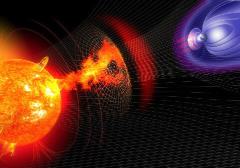

# Solis Projectum

A project which seeks to further understand the relationship between space weather and the impacts to climate and weather changes on Earth.

### Team:
- Aaron Grabish
- Chris Hayes
- Shaurya Patel

---
### Summary
There is a correlation between solar activity and the surface temperature of the Earth.

### Research Questions
- Does sunspot activity have an effect on the yearly average temperature in the United States?
- Does an increase in sunspot activity increase the duration of summer? Or the intensity of summer?
- Does a decrease in sunspot activity increase the duration of winter? Or the severity of winter?

### Techniques & Tools

- Build data retrieval plan
- Clean and Normalize the data
- Normalize
- Analyze
	- Linear Regression
	- Sinusoidal Regression
 - Visualization
    - Scatter Plot

### Data limitations/shortcomings

- Accuracy of observation
- Outside Factors
